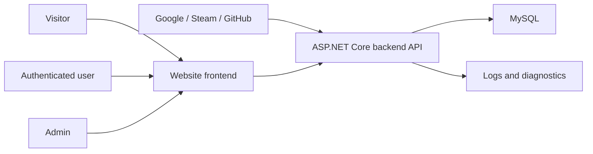

# Backend Architecture Blueprint

Last updated: 2026-05-14

## 1. Scope

This backend powers a personal website with:

- Blog posts with drafts, publishing, tags, and SEO metadata.
- Informational pages such as About, Projects, Uses, Contacts, and legal pages.
- Internal image storage for post banners, post body images, and comment images.
- Authenticated user comments.
- User registration and login through local credentials and external providers.
- Admin-only content management API.
- Public read API for the frontend.
- A structure that can be extended with new modules without rewriting existing features.

Out of scope for the first version:

- Multi-user publishing workflow.
- Full-text search engine.
- Payments, newsletters, or analytics pipelines.
- Non-image file storage.

These can be added later as separate modules.

## 2. Stack

Chosen runtime stack:

- .NET 10
- ASP.NET Core
- Entity Framework Core 9.x
- Pomelo.EntityFrameworkCore.MySql 9.x
- MySqlConnector
- MySQL
- Docker Compose for local infrastructure

EF Core + MySQL provider status checked on 2026-05-14:

| Package | Latest stable checked | Relevant dependency result | Initial conclusion |
| --- | ---: | --- | --- |
| `Microsoft.EntityFrameworkCore` | `10.0.8` | Targets `net10.0` | EF Core 10 is available. |
| `Pomelo.EntityFrameworkCore.MySql` | `9.0.0` | Depends on `Microsoft.EntityFrameworkCore.Relational [9.0.0, 9.0.999]` and `MySqlConnector 2.4.0` | Pomelo is currently an EF Core 9 provider, not EF Core 10. |
| `MySql.EntityFrameworkCore` | `10.0.7` | Has `net10.0` group depending on `Microsoft.EntityFrameworkCore 10.0.7` and `MySql.Data 9.7.0` | Oracle provider has EF Core 10 support. Needs practical validation. |
| `MySqlConnector` | `2.5.0` | Targets `net10.0` among other TFMs | Strong low-level MySQL connector; used by Pomelo. |

Important EF Core constraint: Microsoft documentation says third-party database providers must be compatible with the chosen EF Core version; older provider versions are not assumed compatible with newer EF Core runtimes.

Decision:

- Use `.NET 10` and `ASP.NET Core`.
- Use `Pomelo.EntityFrameworkCore.MySql 9.x`.
- Pin EF Core packages to `9.x`, even though the app itself targets `net10.0`.
- Do not use EF Core 10 for v1, because the preferred Pomelo provider is currently an EF Core 9 provider.

Final v1 persistence stack:

```text
TargetFramework: net10.0
EF Core: 9.x
MySQL provider: Pomelo.EntityFrameworkCore.MySql 9.x
Driver: MySqlConnector
Database: MySQL
```

Why this choice:

- The project is simple and does not require EF Core 10-specific features at the start.
- Pomelo + MySqlConnector is a common MySQL EF Core stack.
- Pinning EF Core to 9 is lower risk than choosing a provider only because it has a matching EF Core 10 major version.

Open validation item:

- Build a small spike for the chosen provider stack before the full project scaffold:
  - Create database.
  - Apply migrations.
  - Insert/update/read entities.
  - Verify `DateTimeOffset`, `Guid`, `decimal`, `json` or long text fields if used.
  - Verify generated SQL and migration output are acceptable.

## 3. System Context



## 4. Backend Shape

Use a modular monolith.

Initial modules:

- `Content`: shared publishing primitives such as slug, status, timestamps, SEO fields.
- `Blog`: posts, tags, post-tag relations, publication state.
- `Pages`: static informational pages managed through the same publication model.
- `Media`: image blobs stored in MySQL and used by internal content features.
- `Comments`: authenticated user comments on content.
- `Identity`: users, local credentials, external logins, roles, blocking, and authorization.
- `Admin`: protected write APIs and operational endpoints.

The first codebase structure can stay simple:

```text
src/
  BlogBackend.Api/
    Modules/
      Blog/
      Pages/
      Media/
      Comments/
      Identity/
      Shared/
    Infrastructure/
      Persistence/
      Configuration/
```

Rules:

- Keep module-specific entities, request models, handlers, and endpoints close together.
- Keep EF Core configuration explicit with `IEntityTypeConfiguration<T>`.
- Avoid premature separate projects unless module boundaries become hard to maintain.
- Keep public API and admin API separated by route groups and authorization policies.

## 5. API Surface Draft

Public API:

- `POST /api/auth/register`
- `POST /api/auth/login`
- `GET /api/auth/external/{provider}/challenge`
- `GET /api/auth/external/{provider}/callback`
- `POST /api/auth/logout`
- `GET /api/me`
- `GET /api/posts`
- `GET /api/posts/{slug}`
- `GET /api/tags`
- `GET /api/pages/{slug}`
- `GET /api/posts/{slug}/comments`
- `POST /api/posts/{slug}/comments`
- `POST /api/media/images`
- `GET /api/media/images/{id}`
- `GET /api/sitemap`

Admin API:

- `GET /api/admin/users`
- `PUT /api/admin/users/{id}/roles`
- `POST /api/admin/users/{id}/block`
- `POST /api/admin/users/{id}/unblock`
- `GET /api/admin/posts`
- `POST /api/admin/posts`
- `PUT /api/admin/posts/{id}`
- `POST /api/admin/posts/{id}/publish`
- `POST /api/admin/posts/{id}/unpublish`
- `GET /api/admin/pages`
- `POST /api/admin/pages`
- `PUT /api/admin/pages/{id}`
- `GET /api/admin/comments`
- `POST /api/admin/comments/{id}/hide`
- `POST /api/admin/comments/{id}/restore`
- `POST /api/admin/media/images`

## 6. Cross-Cutting Concerns

Configuration:

- Use strongly typed options.
- Keep secrets in environment variables or user secrets locally.
- Keep appsettings defaults non-sensitive.

Persistence:

- Use EF Core migrations.
- Never rely on `EnsureCreated` outside throwaway local experiments.
- Add integration tests against real MySQL through Docker once persistence starts.

Validation:

- Validate request DTOs at API boundary.
- Keep domain invariants in application/domain code, not only in controllers.

Observability:

- Structured logging through ASP.NET Core logging abstractions.
- Health endpoints for API and database.

Security:

- Public read endpoints are anonymous.
- Registration and local credential login support username/email/password.
- External login supports Google, Steam, and GitHub through provider-specific adapters.
- Admin write endpoints require the `Admin` or `SuperAdmin` role.
- Superadmin capabilities require the `SuperAdmin` role.
- Blocked users cannot create comments or perform user-level write actions.
- A blocked user may still authenticate unless we explicitly decide to reject blocked logins.
- Exactly one superadmin must exist per application instance.

Superadmin bootstrap:

- Treat superadmin creation as an idempotent bootstrap step that runs after migrations, not as raw user creation inside EF migration code.
- The bootstrap step creates required roles and the initial superadmin user from secure configuration.
- The system must prevent adding a second `SuperAdmin` assignment through application services.
- Startup checks should fail loudly if there are zero or more than one superadmin users.

## 7. Extension Points

New functionality should usually be added as a new module under `Modules/`.

Examples:

- `Projects`: project portfolio entries.
- `Newsletter`: subscription forms and provider integration.
- `CommentAntiSpam`: spam scoring and moderation automation.
- `Search`: indexing and public search endpoint.

A module can own:

- Its own entities.
- Its own endpoint group.
- Its own EF Core configuration.
- Its own service/application logic.

Shared code should be promoted to `Shared` only after at least two modules actually need it.

## 8. Source Notes

Checked sources:

- Microsoft EF Core docs via Context7: provider packages must match the desired EF Core version.
- NuGet flat container package metadata on 2026-05-14:
  - `https://api.nuget.org/v3-flatcontainer/microsoft.entityframeworkcore/index.json`
  - `https://api.nuget.org/v3-flatcontainer/pomelo.entityframeworkcore.mysql/index.json`
  - `https://api.nuget.org/v3-flatcontainer/mysql.entityframeworkcore/index.json`
  - `https://api.nuget.org/v3-flatcontainer/mysqlconnector/index.json`
