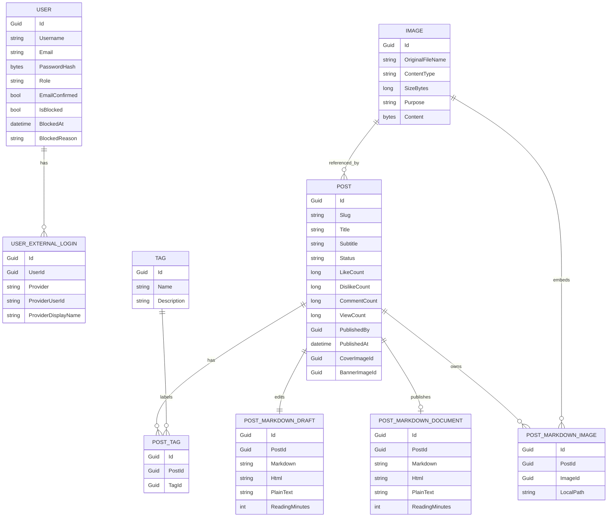

# Data Schema

Last updated: 2026-05-17

This document describes the current logical persistence model and the planned model extensions. The physical schema is generated by EF Core migrations from `BlogDbContext`; when this document and migrations disagree, inspect the current code and migration snapshot before editing.

## 1. Shared Entity Shape

Most persisted domain entities inherit `EntityBase`.

Fields:

- `Id`: `Guid`, required.
- `CreatedBy`: `Guid`, required.
- `CreatedAt`: `DateTime`, required.
- `UpdatedBy`: nullable `Guid`.
- `UpdatedAt`: nullable `DateTime`.
- `IsDeleted`: `bool`.
- `DeletedBy`: nullable `Guid`.
- `DeletedAt`: nullable `DateTime`.

Rules:

- Generated IDs use `Guid.CreateVersion7()`.
- Known technical users use fixed IDs and are the only exception.
- Create/update/delete audit fields are maintained by `EntityAuditSaveChangesInterceptor`.
- Deletes of `EntityBase` entities are soft deletes.
- Queries must explicitly filter `IsDeleted` when deleted rows should be hidden.

## 2. User

Implemented entity: `Modules/Users/User.cs`.

Fields:

- `Id`
- `Username`
- `Email`
- `PasswordHash`
- `Role`
- `EmailConfirmed`
- `IsBlocked`
- `BlockedAt`
- `BlockedReason`
- Audit fields from `EntityBase`
- Navigation: `ExternalLogins`

Constraints and indexes:

- `Username` max length: 64, required, unique.
- `Email` max length: 256, required, unique.
- `PasswordHash` max length: 512, required.
- `Role` stored as string, max length: 32, required.
- `BlockedReason` max length: 512.
- `CreatedAt` required.

Role values:

- `User`
- `Admin`
- `SuperAdmin`

Rules:

- Users are custom application entities, not ASP.NET Core Identity tables.
- Username and email are normalized before persistence.
- Local users authenticate with username/email and password.
- External-login users can have an empty password hash.
- A user has exactly one role.
- Only `KnownUsers.System` and `KnownUsers.SuperAdmin` should have `SuperAdmin`.
- Known technical usernames and emails must not be assigned to non-technical users.

Known technical users:

| User | Id | Username | Email | Role | Login methods |
| --- | --- | --- | --- | --- | --- |
| System | `00000000-0000-0000-0000-000000000001` | `system` | `system@internal.local` | `SuperAdmin` | None |
| Superadmin | `00000000-0000-0000-0000-000000000002` | `superadmin` | `superadmin@internal.local` | `SuperAdmin` | Local password |

## 3. UserExternalLogin

Implemented entity: `Modules/Users/UserExternalLogin.cs`.

Fields:

- `Id`
- `UserId`
- `Provider`
- `ProviderUserId`
- `ProviderDisplayName`
- Navigation: `User`

Constraints and indexes:

- `Provider` max length: 64, required.
- `ProviderUserId` max length: 256, required.
- `ProviderDisplayName` max length: 256.
- Unique composite index: `Provider`, `ProviderUserId`.
- Index: `UserId`.
- Foreign key to `Users`.
- Cascade delete from user to external logins.

Current provider:

- `Steam`

Planned providers:

- `Google`
- `GitHub`

## 4. Post

Implemented entity: `Modules/Posts/Post.cs`.

Fields:

- `Id`
- `Slug`
- `Title`
- `Subtitle`
- `Status`
- `LikeCount`
- `DislikeCount`
- `CommentCount`
- `ViewCount`
- `PublishedBy`
- `PublishedAt`
- `CoverImageId`
- `BannerImageId`
- Audit fields from `EntityBase`
- Navigation: `PostTags`
- Navigation: `MarkdownDraft`
- Navigation: `MarkdownDocument`
- Navigation: `MarkdownImages`

Constraints and indexes:

- `Slug` max length: `PostSlug.MaxLength` (`160`), unique.
- `Title` max length: 256, required.
- `Subtitle` max length: 512.
- Engagement counters default to `0` and are required.
- Legacy `Body` column remains as an unmapped/shadow column for startup backfill only.
- `Status` stored as string, max length: 32, default `Draft`, required.
- `CreatedAt` required.
- Index: `Status`, `PublishedAt`.
- Index: `CreatedAt`.
- Full-text index: `Title`, `Subtitle`, `Slug`.
- Index: `CoverImageId`.
- Index: `BannerImageId`.
- Optional foreign key from `CoverImageId` to `Images`, `SetNull` on delete.
- Optional foreign key from `BannerImageId` to `Images`, `SetNull` on delete.

Status values:

- `Draft`
- `Published`
- `Archived`

Rules:

- Public queries return only non-deleted published posts with non-null `PublishedAt`.
- Admin queries return non-deleted posts across statuses.
- New posts start as drafts.
- New posts start with zero likes, dislikes, comments, and views.
- Publish sets `PublishedBy` and `PublishedAt`.
- Publish copies the current `PostMarkdownDraft` document to `PostMarkdownDocument`.
- Unpublish clears publish metadata.
- Slugs are optional, but if present they must be valid and unique.
- Cover images must reference active images with `Cover` purpose.
- Banner images must reference active images with `Banner` purpose.

## 5. PostMarkdownDraft

Implemented entity: `Modules/Posts/Markdown/PostMarkdownDraft.cs`.

Fields:

- `Id`
- `PostId`
- Owned `Document`
- Audit fields from `EntityBase`

Owned document fields:

- `Markdown`: raw Markdown source.
- `Html`: sanitized backend-rendered HTML.
- `PlainText`: plain text extracted from Markdown.
- `ReadingMinutes`: estimated reading time.

Constraints and indexes:

- Unique index: `PostId`.
- Full-text index: `PlainText`.
- Foreign key to `Posts`, cascade delete.

Rules:

- Stores the current admin-editable Markdown draft for a post.
- Create/update operations render and replace this document.
- Admin previews use backend rendering from the draft source.

## 6. PostMarkdownDocument

Implemented entity: `Modules/Posts/Markdown/PostMarkdownDocument.cs`.

Fields and owned document fields match `PostMarkdownDraft`.

Constraints and indexes:

- Unique index: `PostId`.
- Full-text index: `PlainText`.
- Foreign key to `Posts`, cascade delete.

Rules:

- Stores the published Markdown document snapshot.
- Public post details return `Html` and `ReadingMinutes` from this table.
- Editing a published post does not change this document until publish is run again.

## 7. PostMarkdownImage

Implemented entity: `Modules/Posts/Markdown/PostMarkdownImage.cs`.

Fields:

- `Id`
- `PostId`
- `ImageId`
- `LocalPath`
- Audit fields from `EntityBase`

Constraints and indexes:

- `LocalPath` max length: 128, required.
- Index: `PostId`.
- Index: `ImageId`.
- Unique composite index: `PostId`, `ImageId`.
- Unique composite index: `PostId`, `LocalPath`.
- Foreign key to `Posts`, cascade delete.
- Foreign key to `Images`, cascade delete.

Rules:

- Local Markdown image paths use `images/{imageId}`.
- Backend rendering rewrites local paths to `/api/images/{imageId}` only when the image is attached to the post.

## 8. Tag

Implemented entity: `Modules/Posts/Tags/Tag.cs`.

Fields:

- `Id`
- `Name`
- `Description`
- Audit fields from `EntityBase`
- Navigation: `PostTags`

Constraints and indexes:

- `Name` max length: `TagName.MaxLength` (`20`), required, unique.
- `Description` max length: 512.
- `CreatedAt` required.
- Unique index: `Name`.
- Full-text index: `Name`, `Description`.

Rules:

- Tags are soft-deleted.
- Name must match `^[a-z0-9]+(?:-[a-z0-9]+)*$`.
- Tags do not have a separate slug field.

## 9. PostTag

Implemented entity: `Modules/Posts/Tags/PostTag.cs`.

Fields:

- `Id`
- `PostId`
- `Post`
- `TagId`
- `Tag`
- Audit fields from `EntityBase`

Constraints and indexes:

- Index: `PostId`.
- Index: `TagId`.
- Unique composite index: `PostId`, `TagId`.
- Foreign key to `Posts`, cascade delete.
- Foreign key to `Tags`, cascade delete.

Rules:

- The application soft-deletes removed tag assignments through the audit interceptor.
- Updating post tags removes missing active assignments and can restore previously soft-deleted assignments.

## 10. Post Search Routines

Implemented database routines:

- `NormalizePostSearchBooleanQuery`
- `PostSearchLevenshteinDistance`
- `PostSearchIsLooseMatch`
- `SearchPublishedPostIds`
- `SearchAdminPostIds`

Rules:

- Public search routine applies published-post, date-range, and tag filters in MySQL.
- Admin search routine applies non-deleted and optional status filters in MySQL.
- Routines return ordered post ids; application services hydrate those ids through normal EF queries and existing response mappers.
- Matching combines indexed MySQL full-text search with bounded typo-tolerant matching over recent filtered candidates.

## 11. Image

Implemented entity: `Modules/Assets/Images/Image.cs`.

Fields:

- `Id`
- `OriginalFileName`
- `ContentType`
- `SizeBytes`
- `Purpose`
- `Content`
- Audit fields from `EntityBase`

Constraints and indexes:

- `OriginalFileName` max length: 256, required.
- `ContentType` max length: 128, required.
- `SizeBytes` required.
- `Purpose` stored as string, max length: 32, required.
- `Content` stored as `longblob`, required.
- `CreatedAt` required.
- Index: `Purpose`.

Purpose values:

- `Cover`
- `Banner`
- `Embedded`

Rules:

- Images are soft-deleted.
- Admin uploads currently accept JPEG, PNG, WebP, and GIF up to 5 MB.
- Public retrieval streams the blob from `GET /api/images/{id}`.

## 12. Planned Entities

### Page

Planned fields:

- `Id`
- `Slug`
- `Title`
- `Body`
- `Status`
- `PublishedBy`
- `PublishedAt`
- SEO fields if needed.
- Audit fields.

Rules:

- Public queries return only published pages.
- Admin queries manage drafts and published pages.
- Pages should reuse post publication conventions unless a separate abstraction becomes worthwhile.

### Comment

Planned fields:

- `Id`
- `PostId`
- `AuthorUserId`
- `ParentCommentId` if threaded comments are chosen.
- `Body`
- `Status`
- Audit fields.

Rules:

- Anonymous users cannot comment.
- Blocked users cannot comment.
- Public endpoints return only visible comments.
- Admins can hide or restore comments.

### CommentMedia

Planned fields:

- `CommentId`
- `ImageId`

Rules:

- Only image attachments are in scope for v1.
- Attachment ownership and visibility should follow the comment.

## 13. Relationship Overview

## 14. Open Schema Questions

- Whether post slugs should become immutable after publish.
- Whether slug redirects are needed.
- Whether pages should share a publication abstraction with posts.
- Whether comments are flat or threaded.
- When image blobs should move from MySQL to object storage.
- Whether image dimensions, alt text, and deduplication hashes should be added.
- Whether blocked users should be rejected from all login flows consistently.
