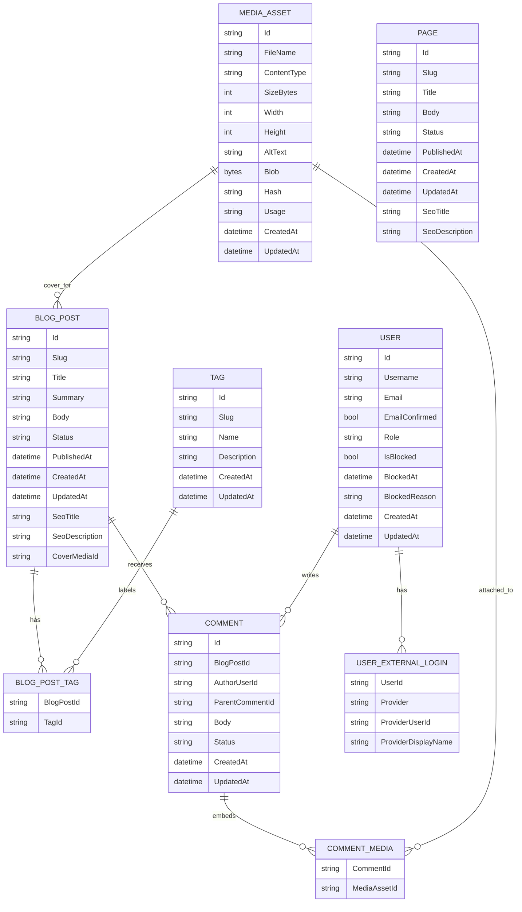

# Data Schema Draft

Last updated: 2026-05-14

This is a first-pass logical schema. It should guide the initial EF Core entities, not freeze the physical database schema yet.

## Core Concepts

Content can be either:

- A blog post.
- An informational page.

Both need publishing state, slugs, timestamps, and SEO metadata. We should share conventions, but not force all content types into one overloaded table until there is a real need.

Users can register and authenticate locally or through external providers. Comments are user-owned and require an authenticated, non-blocked author. Media is stored as image blobs in MySQL for v1.

## Entities

### BlogPost

Fields:

- `Id`
- `Slug`
- `Title`
- `Summary`
- `Body`
- `Status`
- `PublishedAt`
- `CreatedAt`
- `UpdatedAt`
- `SeoTitle`
- `SeoDescription`
- `CoverMediaId`

Indexes:

- Unique `Slug`.
- `Status`, `PublishedAt` for public list queries.

### Tag

Fields:

- `Id`
- `Slug`
- `Name`
- `Description`
- `CreatedAt`
- `UpdatedAt`

Indexes:

- Unique `Slug`.
- Unique `Name` if we want case-normalized tag names.

### BlogPostTag

Fields:

- `BlogPostId`
- `TagId`

Indexes:

- Composite primary key: `BlogPostId`, `TagId`.
- Reverse index: `TagId`, `BlogPostId`.

### Page

Fields:

- `Id`
- `Slug`
- `Title`
- `Body`
- `Status`
- `PublishedAt`
- `CreatedAt`
- `UpdatedAt`
- `SeoTitle`
- `SeoDescription`

Indexes:

- Unique `Slug`.
- `Status`.

### MediaAsset

Fields:

- `Id`
- `FileName`
- `ContentType`
- `SizeBytes`
- `Width`
- `Height`
- `AltText`
- `Blob`
- `Hash`
- `Usage`
- `CreatedAt`
- `UpdatedAt`

Indexes:

- Optional unique `Hash` if deduplication is worth the complexity.
- Optional index on `ContentType`.
- Optional index on `Usage`.

Rules:

- Only image content types are allowed in v1.
- Media is for internal site usage only: post banners, post body images, and comment images.
- Blob storage in DB is accepted for v1, but should stay behind a `Media` module boundary so it can later move to object storage without changing content modules.

### User

Fields:

- `Id`
- `Username`
- `Email`
- `EmailConfirmed`
- `PasswordHash` as bytes
- `Role`
- `IsBlocked`
- `BlockedAt`
- `BlockedReason`
- `CreatedAt`
- `UpdatedAt`

Indexes:

- Unique `Username`.
- Unique `Email`.

Notes:

- Users are implemented with custom application tables, not ASP.NET Core Identity tables.
- `Username` and `Email` are stored in normalized canonical form.
- Users can sign in with username/email/password.

Role values:

- `User`
- `Admin`
- `SuperAdmin`

Rules:

- `Role` is an enum-like value stored directly on `User`.
- A user has exactly one role.
- Exactly one user must have the `SuperAdmin` role per application instance.
- Superadmin uniqueness is enforced by bootstrap and application services; a startup validation must detect invalid database state.

### UserExternalLogin

Fields:

- `UserId`
- `Provider`
- `ProviderUserId`
- `ProviderDisplayName`

Supported providers:

- `Google`
- `Steam`
- `GitHub`

Indexes:

- Unique `Provider`, `ProviderUserId`.
- Index on `UserId`.

### Comment

Fields:

- `Id`
- `BlogPostId`
- `AuthorUserId`
- `ParentCommentId`
- `Body`
- `Status`
- `CreatedAt`
- `UpdatedAt`

Indexes:

- `BlogPostId`, `CreatedAt`.
- `AuthorUserId`, `CreatedAt`.
- Optional `ParentCommentId`, `CreatedAt` for threaded comments.

Rules:

- Only authenticated users can create comments.
- Blocked users cannot create comments.
- Public endpoints return only visible comments.
- Admins can hide or restore comments.

### CommentMedia

Fields:

- `CommentId`
- `MediaAssetId`

Indexes:

- Composite primary key: `CommentId`, `MediaAssetId`.
- Reverse index: `MediaAssetId`, `CommentId`.

## Publication Status

Use a small enum-like value:

- `Draft`
- `Published`
- `Archived`

Visibility rules:

- Public endpoints only return `Published` content.
- Admin endpoints can return all statuses.
- `PublishedAt` is required when status is `Published`.

## Comment Status

Use a small enum-like value:

- `Visible`
- `Hidden`
- `Deleted`

Visibility rules:

- Public endpoints only return `Visible` comments.
- Hidden comments remain available to admins.
- Deleted comments should be soft-deleted unless we explicitly need hard deletion.

## Relationship Draft

## Open Questions

- ID type: `Guid`, ULID string, or numeric identity.
- Body format: Markdown, HTML, or structured blocks.
- Slug policy: immutable after publish or editable with redirects.
- Whether pages need tags or categories later.
- Whether comments are flat or threaded from v1.
- Whether blocked users can still log in and read personalized data.
- Whether external login can create a new user automatically or must be linked after local registration.
